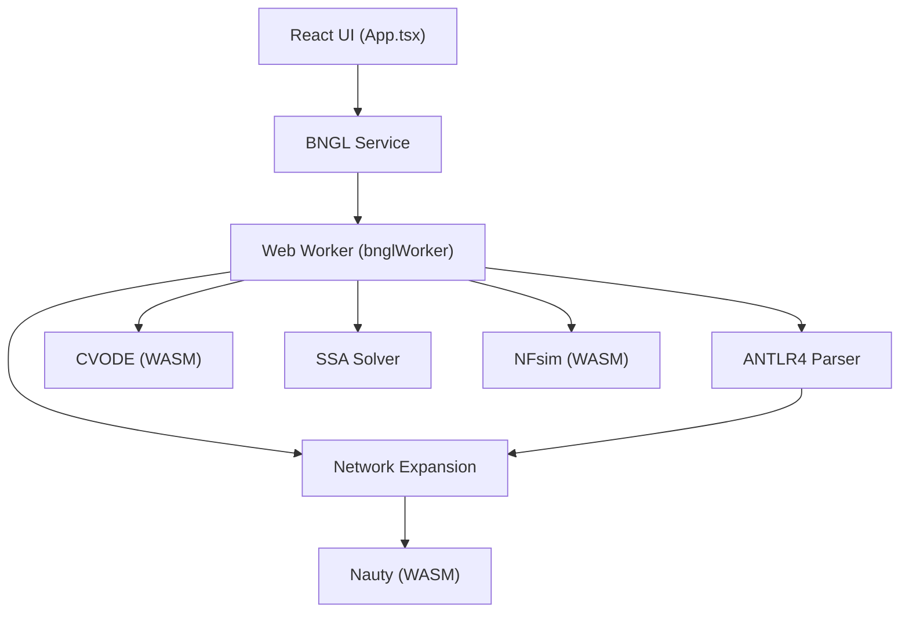

# BioNetGen Playground


**BioNetGen Playground** is a state-of-the-art web-based modeling and simulation environment for BioNetGen (BNGL).
 models: edit BNGL, parse, generate networks, run simulations, and analyze results through multiple visualization and analysis tabs.

**Live demo:** <https://akutuva21.github.io/bngplayground>

## Features

- BNGL editor + parser (client-side ANTLR4)
- Network generation and simulation in the browser (Web Worker + WASM)
- **Primary Solver**: CVODE (SUNDIALS) for stiff ODEs, RK4/RK45 for non-stiff systems
- **Large Network Support**: Symmetry reduction using **Nauty** WASM for fast canonical labeling
- **Network-Free Simulation**: Integrated **NFsim** (WASM) for efficient simulation without network generation
  - **Multi-Compartment Support (cBNGL)**: NFsim now supports compartmentalized models with molecule transport between compartments
- **Visual Designer**: Construct models using a structured visual interface
- Example gallery with keyword + semantic search
- Interactive charts (series toggle / isolate, zoom, export)
- Analysis tabs: parameter scan, identifiability (FIM), steady state, parameter estimation, flux analysis, verification, and more

## Quick Start

```bash
npm install
npm run build
npm run dev
```

## Scripts

| Command | Description |
| --- | --- |
| `npm run dev` | Start the Vite dev server |
| `npm run build` | Production build (also generates semantic-search embeddings) |
| `npm run build:quick` | Production build without embeddings generation |
| `npm run build:full` | Full build including verification |
| `npm run preview` | Preview the production build |
| `npm run test` | Run Vitest once |
| `npm run test:watch` | Run Vitest in watch mode |
| `npm run generate:gdat` | Regenerate GDAT reference fixtures |
| `npm run generate:embeddings` | Generate `public/model-embeddings.json` for semantic search |

## Workflow

1. Pick a model from the Example Gallery (or paste your own BNGL).
2. Edit BNGL in the editor.
3. Click **Parse** to (re)parse the model.
4. Run a simulation (ODE or SSA) and explore results in the tabs.

## Example Gallery + Semantic Search

The Example Gallery features a curated library of **150+ verified BioNetGen models**, organized into functional biological categories:

- **Cancer Biology**: Oncogenic signaling, tumor suppression, and DNA repair.
- **Immunology**: TCR/BCR signaling, FcεRI, innate immunity, and cytokine pathways.
- **Neuroscience**: Synaptic plasticity, ion channels, and neuronal signaling.
- **Cell Cycle & Death**: Mitosis, apoptosis, and cell cycle checkpoints.
- **Metabolism**: Metabolic pathways, enzyme kinetics, and glucose homeostasis.
- **Developmental Biology**: Morphogens, differentiation, and tissue patterning.
- **Multistage**: Models with protocol-based simulation phases (e.g., equilibration).
- **RuleWorld Tutorials**: Official BioNetGen tutorials and comprehensive grammar examples.
- **Example Models**: A complete set of 100 baseline models generated for demonstration.

### Performance & Parity

We maintain high fidelity with canonical BioNetGen (`BNG2.pl`) and provide high-performance simulation capabilities:

- **High Precision**: Integrated **CVODE (SUNDIALS)** solver for handles stiff ODE systems with adaptive time-stepping.
- **Scalability**: Accelerated by **Nauty (WASM)** for fast symmetry reduction and canonical labeling in large reaction networks.
- **Network-Free**: Native **NFsim** support for simulating models that are too large for network expansion.
- **Multi-Compartment**: Full support for **cBNGL** (Compartmental BioNetGen) across both ODE and stochastic solvers.
- **Parity Verified**: **66%+ of public library models** pass automated parity checks against `BNG2.pl` reference results, with 100+ models achieving perfect structural and numerical agreement.

Search capabilities include:

- **Keyword search**: Fast text matching across model names and descriptions.
- **Semantic search**: Natural-language queries (e.g., "MAPK pathway with feedback") using Vector embeddings.

Semantic search uses a precomputed embeddings index at `public/model-embeddings.json`.

- `npm run build` regenerates embeddings automatically.
- Use `npm run build:quick` to skip embedding generation during rapid iteration.

## Tabs

The UI exposes a small set of core tabs by default, with additional analysis tabs behind **More →**.

### Core tabs (always visible)

- **Time Courses**
  - Plots observables vs time.
  - Interactive legend: click to toggle series, double-click to isolate/restore.
  - Drag-to-zoom and double-click to reset view.
  - Optional custom expressions (derived observables) via the Expression panel.

- **Parameter Scan**
  - **1D scan**: sweep a parameter range and plot an observable vs parameter value (drag-to-zoom supported).
  - **2D scan**: heatmap of an observable across two parameters (hover tooltip, click-to-pin, and it scales to fill the panel).
  - Optional surrogate training for fast sweeps on large parameter spaces.

- **Regulatory Graph**
  - Graph view of how rules influence molecular states.
  - Supports time-course overlay for selected influences.

### Advanced tabs (shown via **More →**)

- **What-If Compare**: run a baseline vs modified-parameter simulation and compare trajectories (interactive legend).
- **Contact Map**: molecule-type interaction map; click edges to jump to representative rules.
- **Rule Cartoons**: compact visualizations of reaction rules (cartoon + compact view).
- **Identifiability (FIM)**: Fisher Information Matrix analysis, eigen/sensitivity views, and heatmaps.
- **Steady State**: run an extended ODE sweep and detect steady state (result appears as the final point in Time Courses).
- **Parameter Estimation**: fit parameters to experimental time-series data (includes priors and convergence diagnostics).
- **Flux Analysis**: compute and visualize reaction flux contributions from the expanded reaction network.
- **Verification**: define constraints over observables (inequalities, equality, conservation) and check against simulation results.

## Architecture



## Architecture (high-level)

- **Frontend**: React 19 + TypeScript 5.8 + Vite 6 + Tailwind CSS
- **Concurrency**: Web Workers for parsing, network generation, and simulation (UI remains responsive)
- **Mathematical Solvers**:
  - **CVODE** (SUNDIALS) for high-performance stiff ODE solving
  - **NFsim** for network-free stochastic simulation
  - **Nauty** for high-efficiency canonical labeling and symmetry reduction
- **Parser**: ANTLR4-based BNGL parser for full parity with BNG2.pl
- **Visualization**: Cytoscape.js for networks, Recharts for time series, TensorFlow.js for semantic search

Useful entry points:

- `App.tsx` (app shell)
- `components/EditorPanel.tsx` (editor + run controls)
- `components/VisualizationPanel.tsx` (tabs)
- `services/bnglService.ts` and worker code (parse/simulate)
- `scripts/generateEmbeddings.mjs` (build-time embeddings)

## License

MIT
